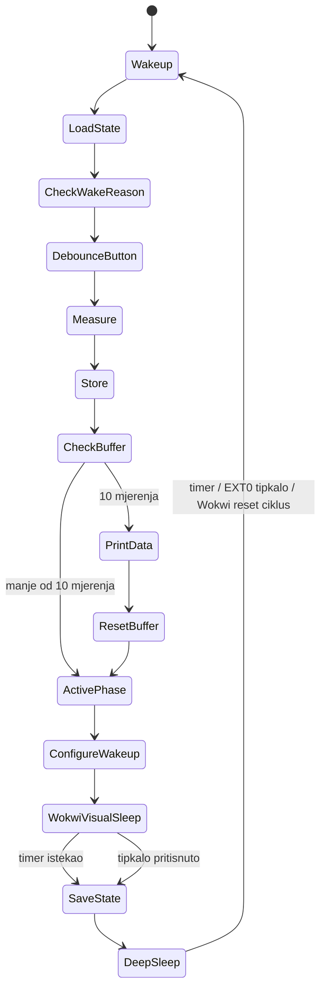

# Dijagram stanja

## Objašnjenje

Dijagram prikazuje logiku rada dataloggera. Nakon buđenja sustav učitava spremljeno stanje, provjerava razlog buđenja, očitava DHT22 senzor, sprema mjerenje i nakon 10 uzoraka ispisuje podatke. Nakon aktivne faze konfigurira se timer wake-up i EXT0 GPIO wake-up tipkalom.

Stanje `WokwiVisualSleep` dodano je samo zato da se u Wokwi simulatoru vizualno vidi razdoblje mirovanja: LED je ugašena, a tipkalo može prekinuti čekanje prije isteka timera. Nakon toga se i dalje poziva stvarni `esp_deep_sleep_start()`.
